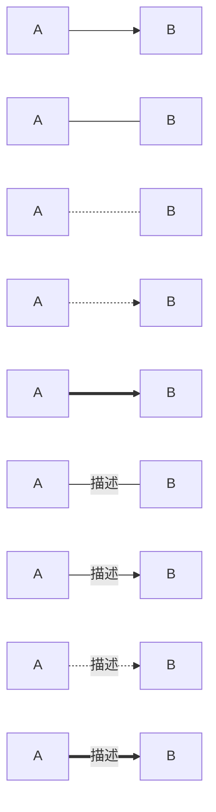

# Markdown 使用教程

==（1）标题==

# 一级标题
## 二级标题
### 三级标题
#### 四级标题
##### 五级标题
###### 六级标题

==（2）字体==
**加粗**
*斜体*
***斜体加粗***
~~删除线~~
==高亮==
我是^上标^
我是~下标~ (注意使用英文字符)
==(3）列表==
+ 一二三四五
+ 
	
1. 一二三四五

==（4）表格==

| MON  | TUE  | WED  |
| ---- | ---- | ---- |
|      |      |      |

==(5)引用==
>
>>
>>>
>>>>

==(6)分割线==

-----------

==(7)代码块==
```
 


```


==（8）流程图==


A --> B A带箭头指向B

A --- B A不带箭头指向B

A -.- B A用虚线指向B

A -.-> B A用带箭头的虚线指向B

A ==> B A用加粗的箭头指向B

A -- 描述 --- B A不带箭头指向B并在中间加上文字描述

A -- 描述 --> B A带箭头指向B并在中间加上文字描述

A -. 描述 .-> B A用带箭头的虚线指向B并在中间加上文字描述

A == 描述 ==> B A用加粗的箭头指向B并在中间加上文字描述


``` 

```



