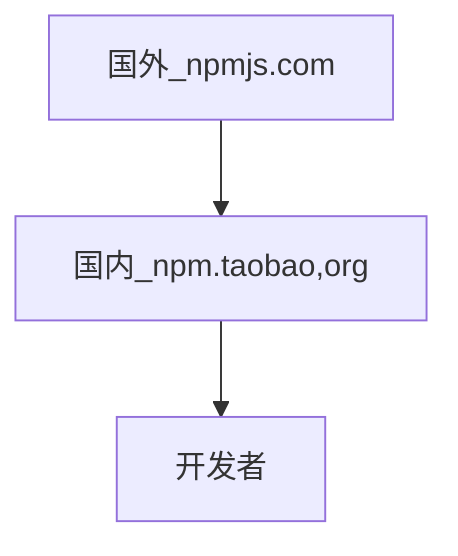

# 后端技术学习笔记

# Node.js Crash Course

```js
let express = require('express')
let app = express()
    //http://localhost:8787/?nickname=simba
app.get('/', function(req, res) {
        console.log('hello world' + req.query.nickname)
        res.send('hello world')
    })
    //restful http://localhost:8787/user/1001
app.get('/user', (req, res) => {
    console.log('hello world' + req.params.id)
    res.send('hello world')
})

app.listen(8787, function() {
    console.log("程序已启动")
})

//终端输入 node filename.js
control+c 退出当前环境
```

JavaScript由**ECMAScript**，DOM，BOM组成

Node.js由**ECMAScript**及Node环境提供的一些附加API组成的


```js
var first = 'hello node.js';
console.log(first);

function fn() {
    console.log('fn 函数被调用了');

}
fn();

for (var i = 0; i < 5; i++) {
    console.log(i);
}

if (true) {
    console.log('123');
}

//pwd查看当前地址

node address
```

Javascript 弊端

+ 文件依赖
+ 命名冲突


Node.js 模块化开发规范：

+ Node.js 规定一个Javascript就是一个模块，模块内部定义的变量和函数默认情况下在外部无法得到
+ 模块内部可以使用exports对象进行成员导出，使用require方法导入其他模块

```js
//模块成员导出
//a.js
//模块内部定义变量
let version=1.0;
//模块内部定义方法
const sayHi=name=>'您好，${name}';
//向模块外部导出数据
exports.version=version;
exports.sayHi=sayHi;


//b.js
//在b.js模块中导入模块a
let a=require('./a.js');
//输出b模块中的version变量
console.log(a.version);
//调用b模块中的sayHi方法并输出其返回值
console.log(a.sayHi('黑马讲师'))；

```

导入模块，后缀可以省略


```js
a.js
const add=(n1,n2)=>n1+n2;
exports.add=add; //第一个add是属性，第二个add是函数

b.js
const a=require('./a.js');
console.log(a.add(10,20));
```


模块导出另一种方式：

```js
module.exports.version=version;
module.exports.sayHi=sayHi;
```


Exports 是 module.exports的别名（地址引用关系），**导出对象最终以module.exports为准**

当exports对象和module.exports对戏那个指向的不是同一个对象时，以module.exports为准


系统模块：

node运行环境提供的API，因为这些API都是以模块化的方式进行开发的，所以我们又称Node运行环境提供的API为系统模块

文件操作fs：

f:file s:system,文件操作系统

```js
const fs=require('fs');
```

读取文件内容

```js
fs.readFile('文件路径/文件名称'，[,'文件编码'],callback);
```


```js
//读取上一级css目录下的base.css
fs.readFile('../css/base.css','utf-8',(err,doc)=>{
  //如果文件读取发送错误，参数err的值为错误对象，否则err的值为null
  //doc参数为文件内容
  
  if(err==null){
    //在控制台中输入文件内容
    console.log(doc);
  }
});
```


```js
//a.js
//1.通过模块的名字fs对模块进行引用
const fs = require('fs');
//2.通过模块内部的readFile方法读取文件内容
fs.readFile('./indexb.js', 'utf-8', (err, doc) => {
    //如果文件读取出错，err是一个对象，包含错误信息
    //如果文件读取正确，err是null
    //doc是文件读取的结果
    console.log(err);
    console.log(doc);
});
//b.js
var first = 'hello node.js';
console.log(first);

function fn() {
    console.log('fn 函数被调用了');

}
fn();

for (var i = 0; i < 5; i++) {
    console.log(i);
}

if (true) {
    console.log('123');
}
//输出
null
var first = 'hello node.js';
console.log(first);

function fn() {
    console.log('fn 函数被调用了');

}
fn();

for (var i = 0; i < 5; i++) {
    console.log(i);
}

if (true) {
    console.log('123');
}
```


写入文件内容：

```js
fs.write('文件路径/文件名称'，'数据'，callback)
```

```js
const content='<h3>正在使用fs.writeFile写入文件内容</h3>';
fs.wirteFile('../index.html',content,err=>({
  if(err!=null){
    console.log(err);
    return;
  }
  console.log('文件写入成功')；
})
```


```js
const fs = require('fs');

fs.writeFile('./demo.txt', '即将要写入的内容', err => { //会自动创建一个demo.txt
    if (err != null) {
        console.log(err);
        return;
    }
    console.log('文件内容写入成功');

})
```


系统模块path路径操作

为什么要路径拼接：

+ 不同操作系统的路径分隔符不统一
+ Windows / \
+ Linux /

语法：

```js
path.join('路径','路径',...)
```

```js
//导入path模块
const path=require('path');
//路径拼接
let finialPath=path.join('itcast','a','b','c.css');
//输出结果itcast\a\b\c.css
console.log(finialPath);
```

```js
//public/uploads/avatar
//引入path模块
const path = require('path');
const finalPath = path.join('public', 'uploads', 'avatar');
console.log(finalPath);
```


相对路径VS绝对路径：

+ 大多数情况用的是绝对路径，因为相对路径有时候相对的是命令行工具的当前工作目录
+ 在读取文件或者设置文件路径时都会选择绝对路径
+ 使用**__dirname**获取当前文件所在的绝对路径（拼接上文件）两个下划线


第三方模块：

别人写好的，具有特定功能的，我们可以直接使用的模块；由于第三方模块通常是由多个文件组成的并且

两种存在形式：

+ 以js文件的形式存在，提供实现项目具体功能的API接口
+ 以命令行工具形式存在，辅助项目开发


获取第三方模块：

npmjs.com:第三方模块的储存和分发仓库

npm(node package manager):node的第三方模块管理工具

+ 下载：npm install 模块名称
+ 模块下载在当前工作目录文件夹里面
+ 卸载：npm uninstall 模块名称


全局安装和本地安装：

+ 命令行工具：全局安装
+ 库文件：本地安装


第三方模块**nodemon**

nodemon是一个命令行工具

Node.js中，每次修改文件都要在命令行中重新执行该文件，非常繁琐

+ 使用npm install nodemon -g 下载它 g（global）
+ 命令行工具中用nodemon命令替代node


命令行：

nodemon + 文件地址：**保存即可，自动执行**

control+c：**断开**


第三方模块 **nrm**

nrm(7pm registry manger):npm 下载地址切换工具

npm 默认地址在国外，国内下载慢




使用步骤：

1. 使用npm install nrm -g
2. 查询可用下载地址列表nrm ls
3. 切换npm下载地址. nrm use 下载地址名称(nrm use taobao)

-------------------------------------------------------------------------------------------------------------------------

# Node.js

Web后台服务器：

Java,PHP,Python, Ruby,.Net,Node.js

Node.js, JavaScript语言编写

[Nodejs官网](nodejs.org)

什么是Node.js:

+ Node.js 不是一门语言
+ Node.js 不是库，不是框架
+ Node.js是一个JavaScript**运行时**环境
+ Node.js 可以解析和执行JavaScript代码
+ 现在的JavaScript可以完全脱离浏览器运行，一切归功于：node.js
+ 构建于 Chrome V8引擎之上
  + 代码只是具有特定格式的字符串而已
  + 引擎可以去解析和执行

Node.js中的JavaScript：

+ 没有BOM，DOM
+ ECMAScript
+ Node.js特性：
  + Event-driven 事件驱动
  + non-blocking I/O model 非阻塞IO模型（异步）
  + lightweight and efficient 轻量和高效

+ npm是世界上最大的开源生态系统
+ 绝大多数JavaScript相关的包都存放在npm里，方便开发人员去下载使用

# Node.js 作用

+ Web服务器后台
+ 命令行工具
  + npm（node）
  + git （c语言）
  + hexo（node）
+ 接口服务器

预备知识：

+ HTML
+ CSS
+ Javascript
+ 简单的命令行操作
  + cd
  + dir
  + ls
  + mkdir
  + rm

目标：

+ B/S 编程模型
  + Browser-Server
  + back-end
  + 任何服务端技术这种BS编程模型都是一样的，和语言无关
  + Node只是作为我们学习BS编程模型的一个工具而已
+ 模块化编程
  + REquire JS
  + SeaJS
  + @import（‘文件路径’）
  + Node中可以像@import一样来引用加载JavaScript脚本文件
+ Node常用API
+ 异步编程
  + 回调函数
  + Promise
  + async
  + generator
+ Express开发框架
+ ECMAscript6（ES6）

# Node运行脚本文件：

1. 创建js文件
2. 打开终端，定位脚本文件目录
3. node file

+ Node 中如果想要进行文件操作，必须导入‘js’核心模块
+ fs中，提供了所有文件操作相关的API

# Node 简单http服务

+ 用Node构建一个Web服务器
+ Node有一个核心模块，http

```js
//1.加载http核心模块
var http = require('http');
```
```js
//2.使用http.createServer()方法创建一个Web服务器
var server = http.createServer()
```
```js
//3.发请求，接受请求，处理请求，反馈（发送响应）,注册request请求事件，当客户端请求过来，就会自动触发服务器request请求事件，然后执行第二个参数：回调处理
//request请求事件处理函数，需要接受两个参数：
//Request请求对象：用来获取客户端的一些请求信息，例如请求路径
//Response响应对象：用来给客户端发送响应消息
server.on('request',function(request,response){
  console.log('收到客户端请求了,请求路径是:'+request.url)
  //response 对象有一个方法，write可以用来给客户端发送响应数据
  //write可以用多次，但是最后一定要使用end来结束响应，否则客户端会一直等待
  response.write('hello')
  response.write('nodejs')
  //告诉客户端，话说完了，可以呈递给用户了
  response.end()
})
```
```js
//4.绑定端口号，启动服务器
server.listen(3000,function(){
  console.log('服务器启动成功了，可以通过http://127.0.0.1:3000/来访问')
})
```


```js
var http = require('http');
var server = http.createServer()
server.on('request', function(request, response) {
        console.log('收到客户端请求了,请求路径是:' + request.url)
          
        response.write('hello')
        response.write('nodejs')
        response.end()
    })
    
server.listen(3000, function() {
    console.log('服务器启动成功了，可以通过http://127.0.0.1:3000/来访问')
})
```

小结：

1. 创建Server
2. 监听request请求事件，设置请求处理函数 

```js
server.on('request',function(req,res){
  console.log('收到请求，请求路径是'+req.url)
  res.end('hello')//更简单的方式
})
```

3. 绑定端口号

```js
server.listen(3000,function(){
  console.log('服务器启动成功了')
}
```

根据不同请求路径返回不同数据：:

1. 获取请求路径:req.url获取的是端口号之后的那一部分路径

2. 判断路径处理响应

```js
var url=req.url
if(url === '/'){
  res.end('index.page')
}else if{
  res.end('login page')
}else {
  res.end('404 Not Found.')
}
```

响应的类型只能是二进制数据或字符串

# Node中的JavaScript

+ ECMAScript
  + 没有DOM，BOM
+ 核心模块
+ 第三方模块
+ 用户自定义模块

核心模块：

Node为JavaScript提供了很多服务器级别的API，这些API绝大多数都包装到了一个具名的核心模块中。

需要使用模块，必须调用

```js
var fs=require('fs')
```

# Node 模块系统

+ require 是一个方法
+ 作用是用来:
  + 加载模块
  + 拿到被加载文件模块导出的接口对象
+ 三种模块：
  + 具名的核心模块
  + 用户自己编写的文件模块
+ Node 没有全局作用域，只有模块作用域：内部访问不到外部，外部访问不到内部
+ 文件后缀名可以省略


a.js文件

```js
console.log('a start')
require('./b.js')
console.log('a end')
```

b.js

```js
console.log(b start)
require('./c.js')
console.log('b end')
```

c.js

```js
console.log('c start')
```

输出结果：

```js
a start
b start
c start
b end
a end
```


访问文件内部对象：

+ 每个文件模块中都提供了一个对象：exports
+ exports默认是一个空对象，要做的就是把所有需要被外部访问的对象加载进去

a.js

```js
var ret=require('./b');
console.log(ret.foo)
```

b.js

```js
var foo='bbb'
exports.foo='hello'
```

输出结果：

```js
node a.js
//hello
```


a.js

```js
var bExports=require('./b')
console.log(bExports.foo);//用的时候要用exports.+所需对象访问
console.log(bExports.add(10,30))//用的时候要用exports.+所需对象访问
```

b.js

```js
var foo='bbb';
exports.foo='hello';//把hello加载进exports这个对象里面，用的时候要用exports.+所需对象访问
exports.add=function(x,y){
  return x+y;
}//把add这个函数加载进exports这个对象里面，用的时候要用exports.+所需对象访问
```

输出结果：

```js
node a
//hello
//40
```

# ip地址和端口号概念

+ 所有联网的程序都需要进行网络通信
+ 计算机中只有一个物理网卡，而且同一个局域网中，网卡的地址必须是唯一的
+ 网卡是通过唯一的 ip 地址来进行定位的
+ IP地址用来定位计算机，端口号用来定位具体的应用程序（所有具有联网通信的软件都必须要端口号）


# 回调函数

+ Node.js 异步编程的直接体现就是回调。

+ 异步编程依托于回调来实现，但不能说使用了回调后程序就异步化了。

+ 回调函数在完成任务后就会被调用
+ Node 使用了大量的回调函数
+ Node 所有 API 都支持回调函数。

**阻塞代码**：

Main.txt

```txt
hello world
```

main.js

```js
var fs = require("fs");

var data = fs.readFileSync('main.txt');

console.log(data.toString());
console.log("程序执行结束!");
//hello world
//程序执行结束!
```

**非阻塞代码**：

Main.txt

```txt
hello world
```

Main.js

```js
var fs = require("fs");

fs.readFile('main.txt', function (err, data) {
    if (err) return console.error(err);
    console.log(data.toString());
});

console.log("程序执行结束!");
```

+ 第一个例子在文件读取完后才执行完程序，第二个实例我们呢不需要等待文件读取完

+ 因此，阻塞按是按顺序执行的，而非阻塞是不需要按顺序的，所以如果需要处理回调函数的参数，我们就需要写在回调函数内。

事件循环：

+ Node.js 是单进程单线程应用程序，但是通过事件和回调支持并发，所以性能非常高。

+ Node.js 的每一个 API 都是异步的，并作为一个独立线程运行，使用异步函数调用，并处理并发。

+ Node.js 基本上所有的事件机制都是用设计模式中观察者模式实现。

+ Node.js 单线程类似进入一个while(true)的事件循环，直到没有事件观察者退出，每个异步事件都生成一个事件观察者，如果有事件发生就调用该回调函数.

>  Node.js 有多个内置的事件，我们可以通过引入 events 模块，并通过实例化 EventEmitter 类来绑定和监听事件

```js
// 引入 events 模块
var events = require('events');
// 创建 eventEmitter 对象
var eventEmitter = new events.EventEmitter();

// 创建事件处理程序
var connectHandler = function connected() {
   console.log('连接成功。');
  
   // 触发 data_received 事件 
   eventEmitter.emit('data_received');
}

// 绑定 connection 事件处理程序
eventEmitter.on('connection', connectHandler);
 
// 使用匿名函数绑定 data_received 事件
eventEmitter.on('data_received', function(){
   console.log('数据接收成功。');
});

// 触发 connection 事件 
eventEmitter.emit('connection');

console.log("程序执行完毕。");
//连接成功。
//数据接收成功。
//程序执行完毕。
```


